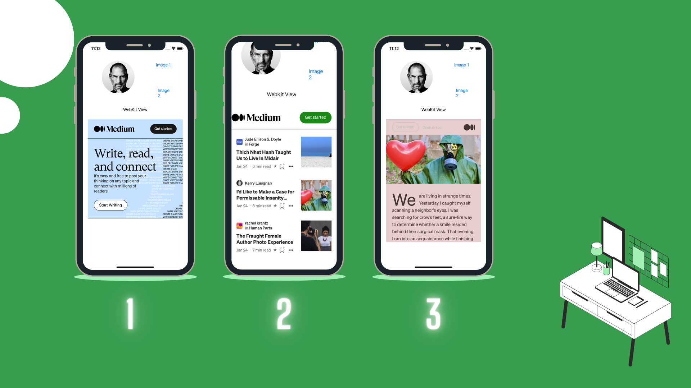

We use it when we want to use any website within the application.

## Use Of
1.WebKit library imported to viewController

2.get internet permission, we do this by adding "App transport security" in our info.plist file.
In this we add its sub property "Allow Arbitrary Loads".

